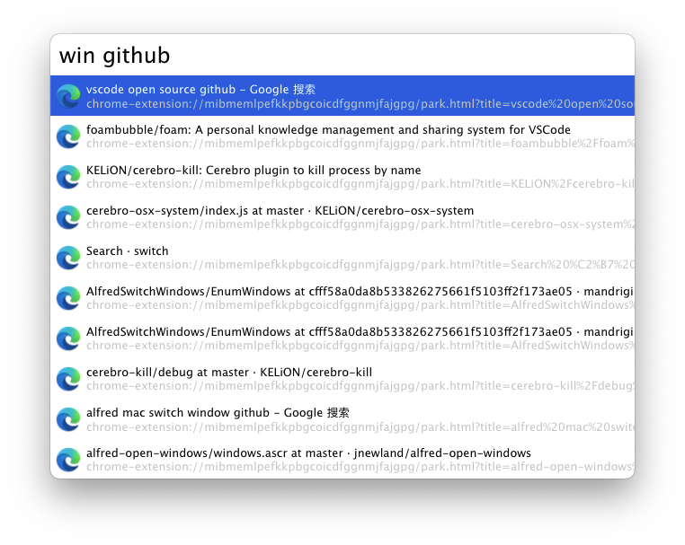

# cerebro-mac-switch-window

> [Cerebro](http://www.cerebroapp.com) plugin to find window and switch



## Install

```shell
cd ~/Library/Application\ Support/Cerebro/plugins/
yarn add cerebro-mac-switch-window
```
## Usage

In Cerebro, type `win something` to find your window and browser tab. Use <kbd>↩</kbd> to kill selected process.

## Related

- [Cerebro](http://github.com/KELiON/cerebro) – main repo for Cerebro app;
- [cerebro-plugin](https://github.com/KELiON/cerebro-plugin) – boilerplate to create plugins for Cerebro app

## License

MIT © [xcodebuild](https://github.com/xcodebuild)

## Related

### EnumWindows & Apple Script

Code for EnumWindows & Apple Script is fork from https://github.com/mandrigin/AlfredSwitchWindows
